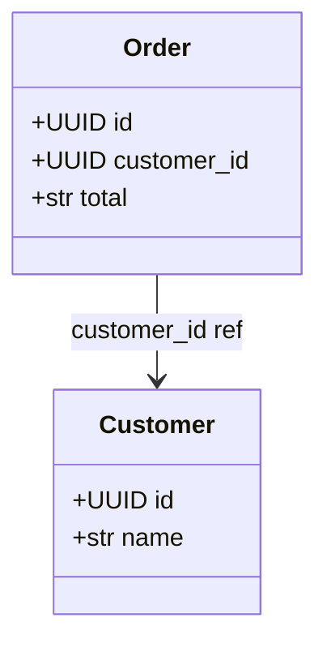

# Export scope / projection / relationship diagrams

**Goal:** turn prism's structure into a diagram — for docs, review, or just
seeing the shape of things. Prism emits **text only** (no Graphviz/Mermaid/D2
dependency); pipe the output to those tools, or paste Mermaid straight into a
GitHub file like this one.

Three builders each produce a `Diagram`, which renders to Mermaid, DOT, D2, or
`as_dict()` (the raw IR):

```python
from typing import Annotated
from uuid import UUID

from pydantic_prism import Scope, ScopedModel, scoped, ref, scope_diagram, projection_diagram


class Public(Scope): ...
class Internal(Public): ...


class Customer(ScopedModel):
    id: Annotated[UUID, scoped(Public)]
    name: Annotated[str, scoped(Public)]


class Order(ScopedModel):
    id: Annotated[UUID, scoped(Public)]
    customer_id: Annotated[UUID, ref(Customer), scoped(Public)]
    total: Annotated[str, scoped(Internal)]


scope_diagram(Public, Internal).to_mermaid()   # the scope inheritance graph
projection_diagram(Order).to_dot()             # a model + its projections, with fields
Order.__refs__.diagram().to_d2()               # the cross-model relationship graph
scope_diagram().as_dict()                       # no args: every scope, as JSON-able data
```

`Order.__refs__.diagram().to_mermaid()` produces the following, which GitHub
renders inline:



Every builder takes `direction="TD"` (default) or `"LR"`.

## From the shell

```console
$ prism diagram scope                                       # all scopes → Mermaid (stdout)
$ prism diagram projection myapp.models:Order --format dot --output order.dot
$ prism diagram refs myapp.models:Order --format json
```

`prism diagram {scope|projection|refs} [module:Name ...]` with
`--format {mermaid,dot,d2,json}` (default `mermaid`), `--output FILE`, and
`--direction {TD,LR}`. `scope` takes optional scope paths (none = all);
`projection`/`refs` take exactly one model path.

## Ship a model doc

Set `readme = "MODELS.md"` in `[tool.pydantic-prism]` (or `prism gen --readme
PATH`) and [`prism gen`](generate-editor-stubs.md) writes a GitHub-flavoured
Markdown doc beside the stub — scope hierarchy, per-model projection fan-out,
and relationship diagrams as `mermaid` blocks, plus per-projection field tables.
`prism check` verifies it's current, so a stale doc fails CI like a stale stub.
The auto-generated [`examples/*/README.md`](../../examples) files are produced
the same way.
