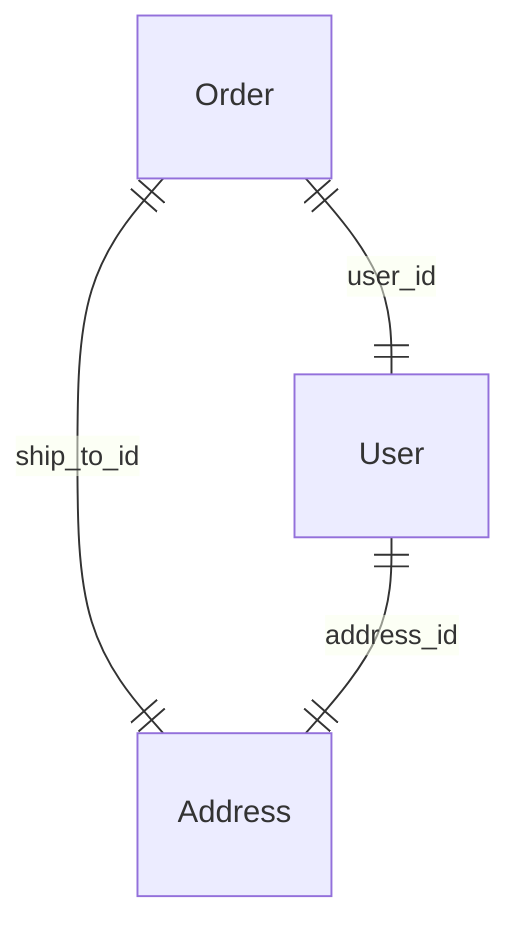

# Use case — ref-graph visualization (Mermaid / ERD export)

Captured 2026-06-10 (market/feature dive). Positioning + feature note, parked
for the docs restructure. Pairs with
[PII governance](use-case-pii-governance.md) as its visual.

> **Status update (2026-06-10): the core is BUILT.** `src/pydantic_prism/_diagram.py`
> ships a `Diagram` IR with three builders — `scope_diagram`, `projection_diagram`,
> and `RefGraph.diagram()` — rendering to `to_mermaid()` / `to_dot()` / `to_d2()` /
> `as_dict()`. 100% covered, 22 tests (`tests/test_diagram.py`). The remaining
> opportunity is **not** the renderer (done); it is the two items below that turn it
> from an ERD into a governance tool: **(1) a `prism graph` CLI** (today only
> `gen`/`check` exist) and **(2) the PII/classification overlay** (the `--pii`
> idea). Everything after this line that describes the *renderer* is now history;
> read it as "why", and see the two remaining bets at the end.

## The bet

`__refs__` already holds the whole relationship graph and `walk()` already
traverses it (cycle-safe, BFS). Rendering it as a Mermaid / Graphviz / ERD
diagram is cheap to build, screenshot-friendly, and turns invisible
introspection into the README's headline visual. It is the kind of feature that
gets a project shared.

Cardinality comes straight from `RefShape` (`SCALAR` → one, `COLLECTION` /
`KEYED_DICT` → many); kinds (`ref` / `backref` / `embedded`) can render as edge
styles. Overlaid with the [classification](use-case-pii-governance.md)
dimension, the same diagram becomes a **data-flow / PII map** — the governance
artifact in picture form, which is the version a compliance reviewer actually
wants.

## Remaining bets (the renderer is done)

**1. `prism graph` CLI.** Wire the existing builders into `_codegen.py`'s
argparse (which today only registers `gen`/`check`):
`prism graph [--kind ref|projection|scope] [--format mermaid|dot|d2|json] [--direction TD|LR] [--pii]`,
scanning the configured `[tool.pydantic-prism] modules`. Low effort — the
rendering already exists; this is CLI plumbing + module loading (reuse codegen's
loader).

**2. PII / classification overlay (`--pii`) — the actual differentiator.**
Today `ref_diagram` labels edges `field_name (kind)` and carries field
descriptions in the IR, but does **not** annotate classification. Overlaying
[governance](use-case-pii-governance.md) — colour/tag classified fields, mark
ref edges that carry PII downstream — turns the same diagram into a *data-flow /
compliance map*, which is the version a reviewer wants. This needs the
classification concept to exist first (still a prototype), so it is **gated on
the governance work**, not on the renderer.

Minor polish while in here: ref-edge labels could include cardinality
(`RefShape` scalar/many is available but unused) and optionality.

## Why low-risk

- Pure read-only over existing structures; no changes to the projection engine.
- No new dependencies for Mermaid (it's text); Graphviz/DOT is also text.
- Naturally co-markets the relationship graph — the actual differentiator —
  rather than the projection half that has prior art.

## Considered and parked: runtime sparse fieldsets

A GraphQL-style `?fields=...` runtime projection (JSON:API / OData style) came up
in the same dive. Lower conviction: it's a *different axis* from prism's
compile-time, statically-typed scopes and risks diluting the `prism gen`
static-typing story. Note it here so it isn't re-discovered as novel; revisit
only if real demand appears.
