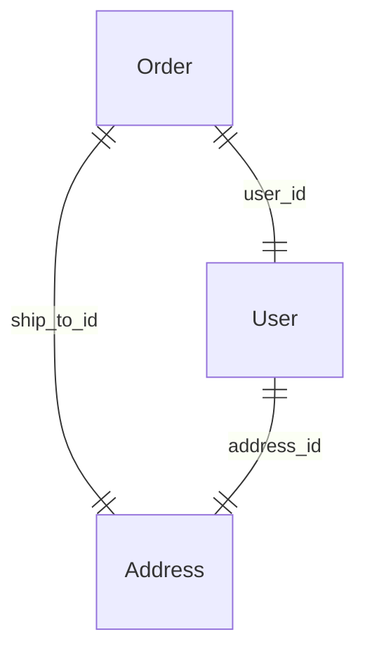

# Use case — ref-graph visualization (Mermaid / ERD export)

Captured 2026-06-10 (market/feature dive). Positioning + feature note, parked
for the docs restructure. Pairs with
[PII governance](use-case-pii-governance.md) as its visual.

## The bet

`__refs__` already holds the whole relationship graph and `walk()` already
traverses it (cycle-safe, BFS). Rendering it as a Mermaid / Graphviz / ERD
diagram is cheap to build, screenshot-friendly, and turns invisible
introspection into the README's headline visual. It is the kind of feature that
gets a project shared.

Cardinality comes straight from `RefShape` (`SCALAR` → one, `COLLECTION` /
`KEYED_DICT` → many); kinds (`ref` / `backref` / `embedded`) can render as edge
styles. Overlaid with the [classification](use-case-pii-governance.md)
dimension, the same diagram becomes a **data-flow / PII map** — the governance
artifact in picture form, which is the version a compliance reviewer actually
wants.

## Candidate surface

| | |
|---|---|
| `Model.to_mermaid()` / `RefGraph.to_mermaid()` | string out, drop into docs |
| CLI `prism graph [--format mermaid\|dot] [--pii]` | emit for a module of models |
| `--pii` overlay | colour/annotate classified fields and edges that carry them |

## Why low-risk

- Pure read-only over existing structures; no changes to the projection engine.
- No new dependencies for Mermaid (it's text); Graphviz/DOT is also text.
- Naturally co-markets the relationship graph — the actual differentiator —
  rather than the projection half that has prior art.

## Considered and parked: runtime sparse fieldsets

A GraphQL-style `?fields=...` runtime projection (JSON:API / OData style) came up
in the same dive. Lower conviction: it's a *different axis* from prism's
compile-time, statically-typed scopes and risks diluting the `prism gen`
static-typing story. Note it here so it isn't re-discovered as novel; revisit
only if real demand appears.
