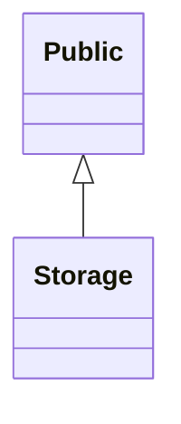
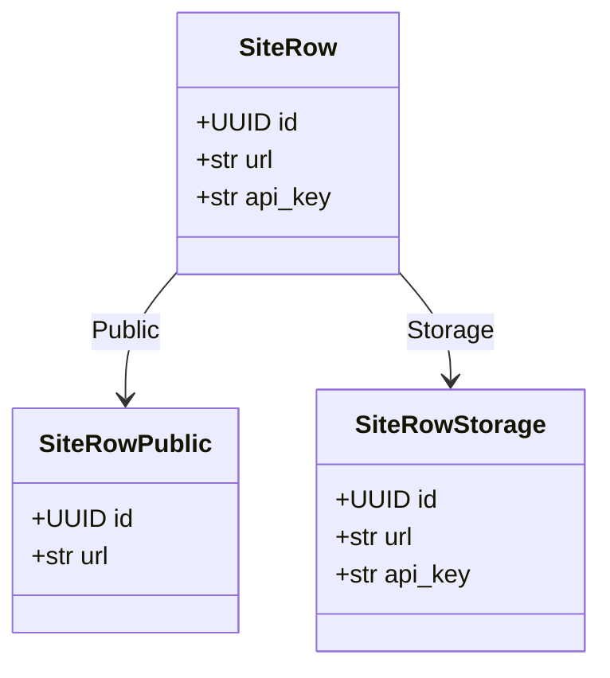

# Generated projection models

<!-- generated by `python bin/gen_example_readmes.py` — do not edit; regenerate with `python bin/gen_example_readmes.py` -->

## Scopes

## SiteRow

### SiteRowPublic — scope `Public`

| field | type | description |
|---|---|---|
| id | UUID | Row identifier. |
| url | str | Public site URL. |

### SiteRowStorage — scope `Storage`

| field | type | description |
|---|---|---|
| id | UUID | Row identifier. |
| url | str | Public site URL. |
| api_key | str | Secret API key (storage-only). |
