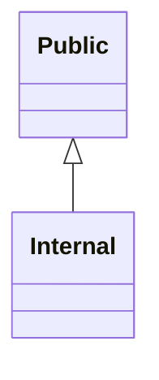
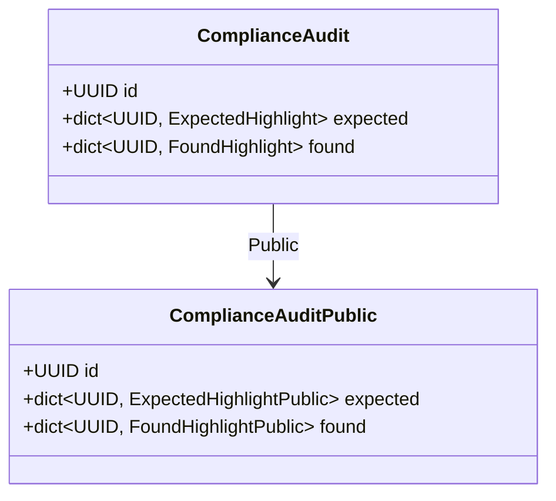
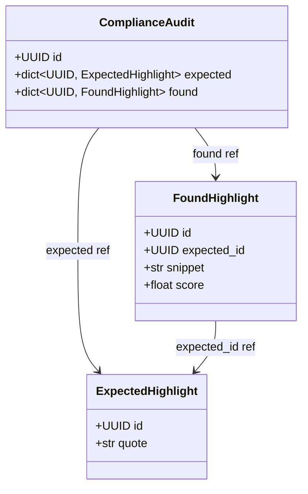
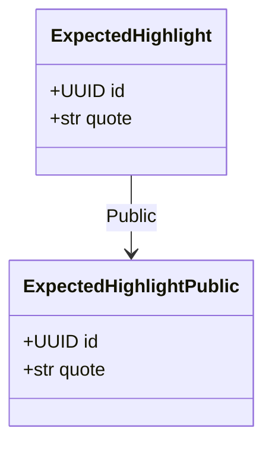
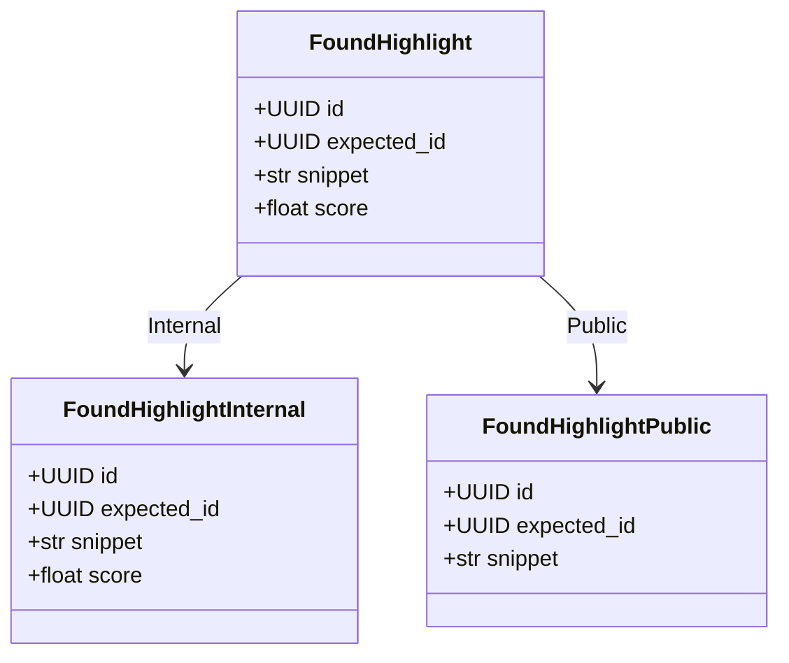
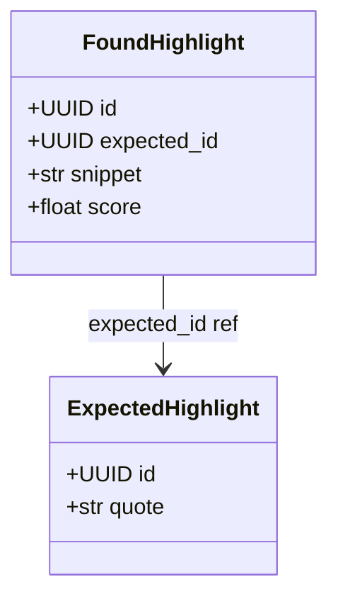

# Generated projection models

<!-- generated by `python bin/gen_example_readmes.py` — do not edit; regenerate with `python bin/gen_example_readmes.py` -->

## Scopes

## ComplianceAudit

### ComplianceAuditPublic — scope `Public`

| field | type | description |
|---|---|---|
| id | UUID | Audit identifier. |
| expected | dict[UUID, ExpectedHighlightPublic] | Expected highlights, keyed by their id. |
| found | dict[UUID, FoundHighlightPublic] | Found highlights, keyed by their id. |

### ComplianceAudit relationships

## ExpectedHighlight

### ExpectedHighlightPublic — scope `Public`

| field | type | description |
|---|---|---|
| id | UUID | Highlight identifier. |
| quote | str | The text to disclose. |

## FoundHighlight

### FoundHighlightInternal — scope `Internal`

| field | type | description |
|---|---|---|
| id | UUID | Match identifier. |
| expected_id | UUID | The expected highlight this matched. |
| snippet | str | Matched text snippet. |
| score | float | Match confidence (internal). |

### FoundHighlightPublic — scope `Public`

| field | type | description |
|---|---|---|
| id | UUID | Match identifier. |
| expected_id | UUID | The expected highlight this matched. |
| snippet | str | Matched text snippet. |

### FoundHighlight relationships

