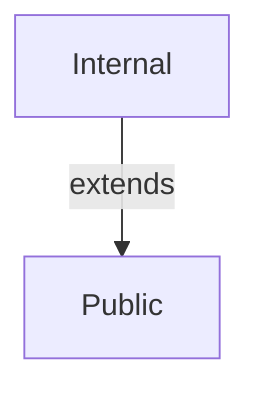
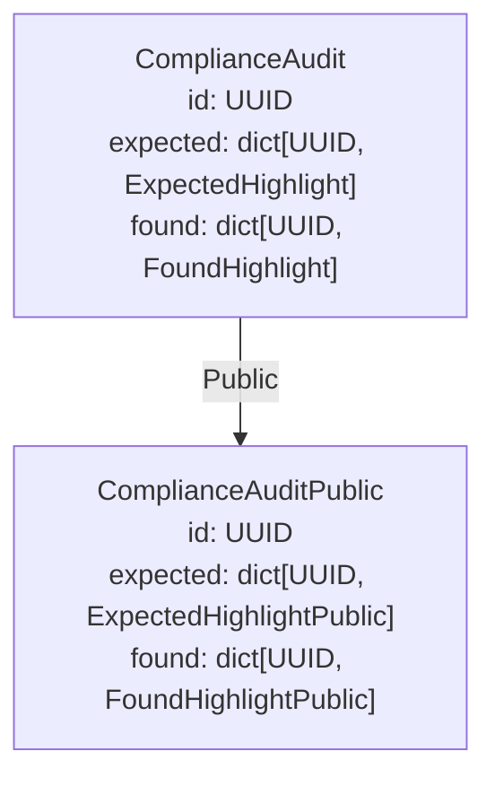
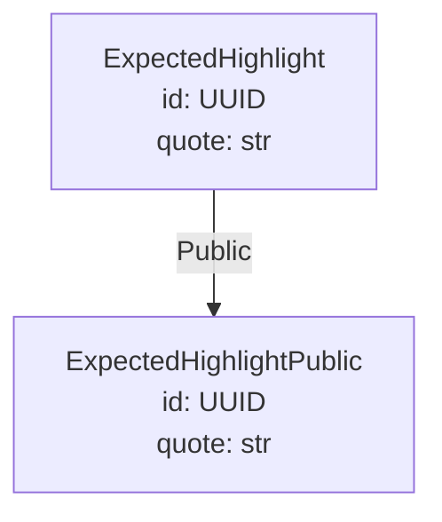
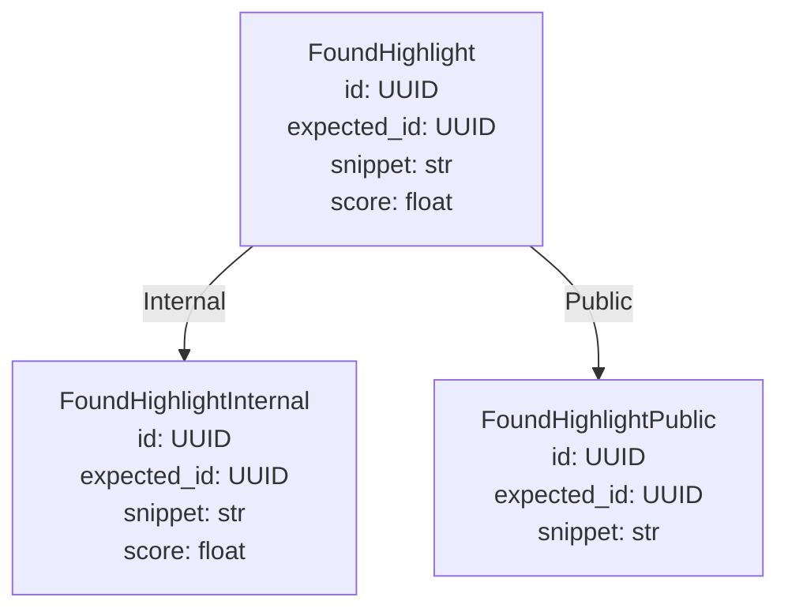

# Generated projection models

<!-- generated by `prism gen` — do not edit; regenerate with `prism gen` -->

## Scopes



## ComplianceAudit



### ComplianceAuditPublic — scope `Public`

| field | type | description |
|---|---|---|
| id | UUID |  |
| expected | dict[UUID, ExpectedHighlightPublic] |  |
| found | dict[UUID, FoundHighlightPublic] |  |

### ComplianceAudit relationships

```mermaid
graph TD
    ComplianceAudit["ComplianceAudit<br/>id: UUID<br/>expected: dict[UUID, ExpectedHighlight]<br/>found: dict[UUID, FoundHighlight]"]
    ExpectedHighlight["ExpectedHighlight<br/>id: UUID<br/>quote: str"]
    FoundHighlight["FoundHighlight<br/>id: UUID<br/>expected_id: UUID<br/>snippet: str<br/>score: float"]
    ComplianceAudit -->|expected (ref)| ExpectedHighlight
    ComplianceAudit -->|found (ref)| FoundHighlight
    FoundHighlight -->|expected_id (ref)| ExpectedHighlight
    classDef partial stroke-dasharray: 5 5;
```

## ExpectedHighlight



### ExpectedHighlightPublic — scope `Public`

| field | type | description |
|---|---|---|
| id | UUID |  |
| quote | str |  |

## FoundHighlight



### FoundHighlightInternal — scope `Internal`

| field | type | description |
|---|---|---|
| id | UUID |  |
| expected_id | UUID |  |
| snippet | str |  |
| score | float |  |

### FoundHighlightPublic — scope `Public`

| field | type | description |
|---|---|---|
| id | UUID |  |
| expected_id | UUID |  |
| snippet | str |  |

### FoundHighlight relationships

```mermaid
graph TD
    ExpectedHighlight["ExpectedHighlight<br/>id: UUID<br/>quote: str"]
    FoundHighlight["FoundHighlight<br/>id: UUID<br/>expected_id: UUID<br/>snippet: str<br/>score: float"]
    FoundHighlight -->|expected_id (ref)| ExpectedHighlight
    classDef partial stroke-dasharray: 5 5;
```
