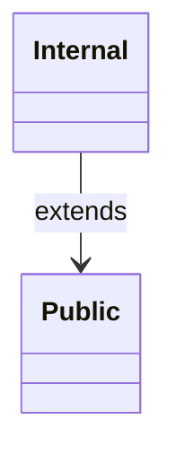
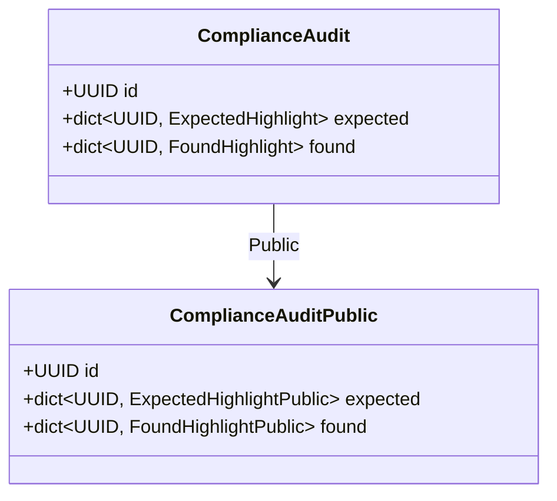
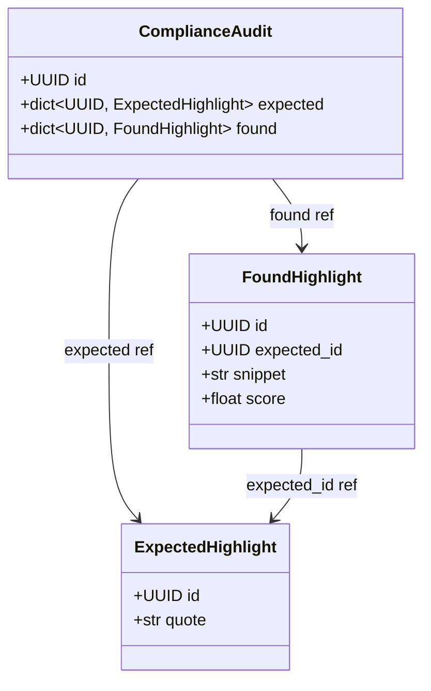
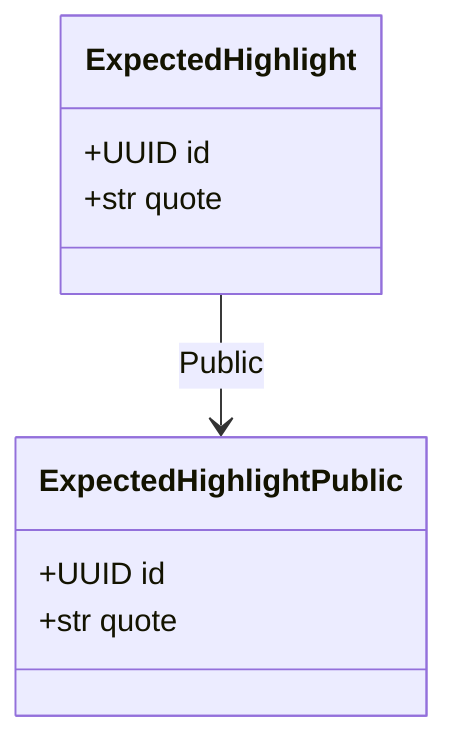
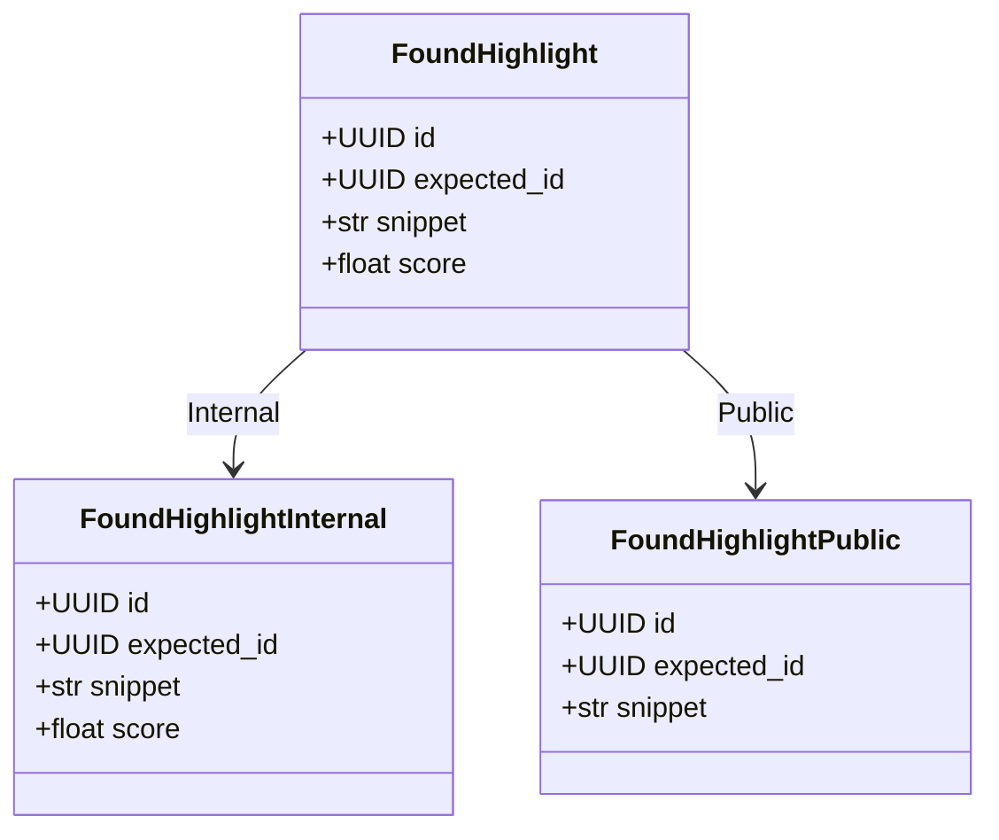
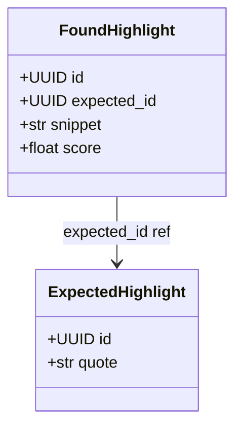

# Generated projection models

<!-- generated by `python bin/gen_example_readmes.py` — do not edit; regenerate with `python bin/gen_example_readmes.py` -->

## Scopes

## ComplianceAudit

### ComplianceAuditPublic — scope `Public`

| field | type | description |
|---|---|---|
| id | UUID |  |
| expected | dict[UUID, ExpectedHighlightPublic] |  |
| found | dict[UUID, FoundHighlightPublic] |  |

### ComplianceAudit relationships

## ExpectedHighlight

### ExpectedHighlightPublic — scope `Public`

| field | type | description |
|---|---|---|
| id | UUID |  |
| quote | str |  |

## FoundHighlight

### FoundHighlightInternal — scope `Internal`

| field | type | description |
|---|---|---|
| id | UUID |  |
| expected_id | UUID |  |
| snippet | str |  |
| score | float |  |

### FoundHighlightPublic — scope `Public`

| field | type | description |
|---|---|---|
| id | UUID |  |
| expected_id | UUID |  |
| snippet | str |  |

### FoundHighlight relationships

