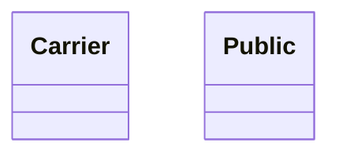
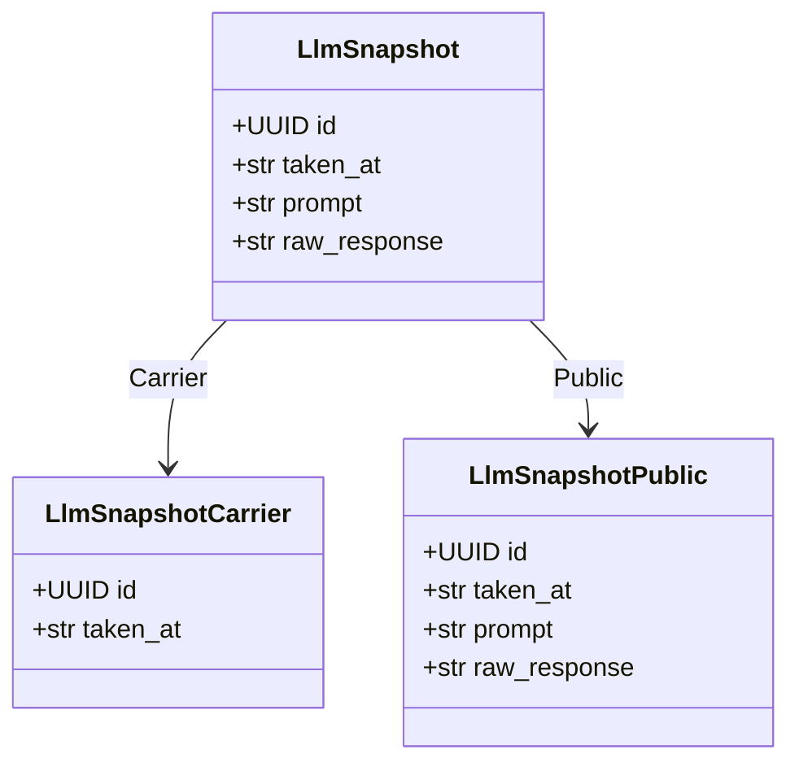
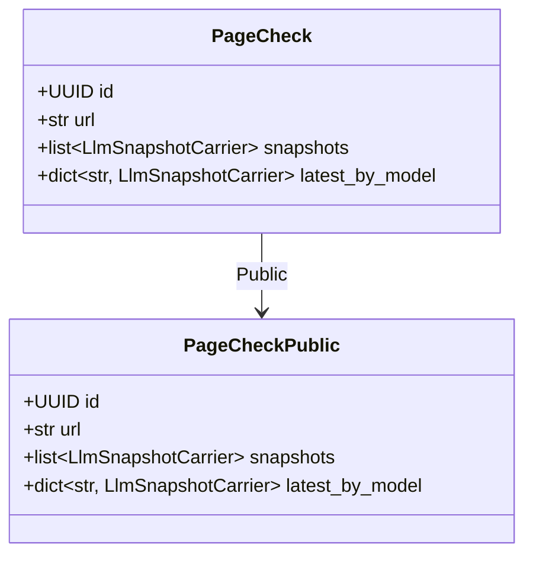
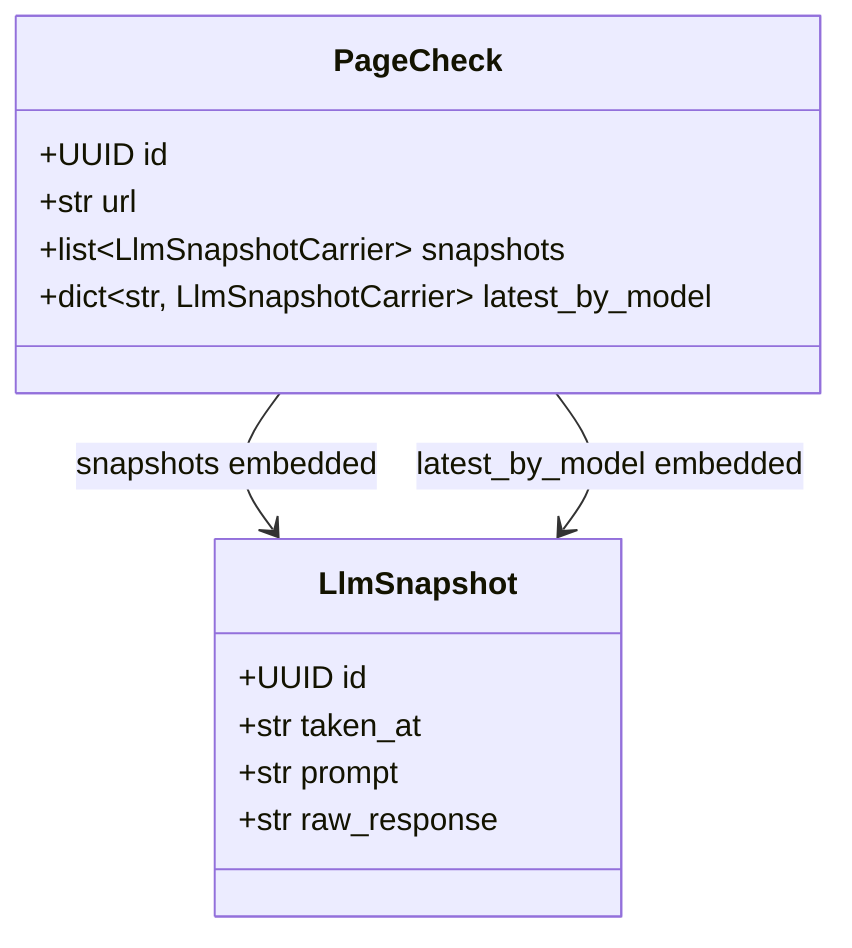

# Generated projection models

<!-- generated by `python bin/gen_example_readmes.py` — do not edit; regenerate with `python bin/gen_example_readmes.py` -->

## Scopes

## LlmSnapshot

### LlmSnapshotCarrier — scope `Carrier`

| field | type | description |
|---|---|---|
| id | UUID | Snapshot identifier. |
| taken_at | str | When the snapshot was taken. |

### LlmSnapshotPublic — scope `Public`

| field | type | description |
|---|---|---|
| id | UUID | Snapshot identifier. |
| taken_at | str | When the snapshot was taken. |
| prompt | str | Prompt sent to the LLM. |
| raw_response | str | Raw model response. |

## PageCheck

### PageCheckPublic — scope `Public`

| field | type | description |
|---|---|---|
| id | UUID | Page-check identifier. |
| url | str | Checked page URL. |
| snapshots | list[LlmSnapshotCarrier] | Snapshot carrier records ({id, taken_at}). |
| latest_by_model | dict[str, LlmSnapshotCarrier] | Latest snapshot per model name. |

### PageCheck relationships

