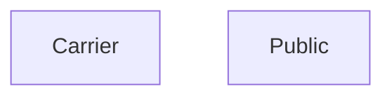
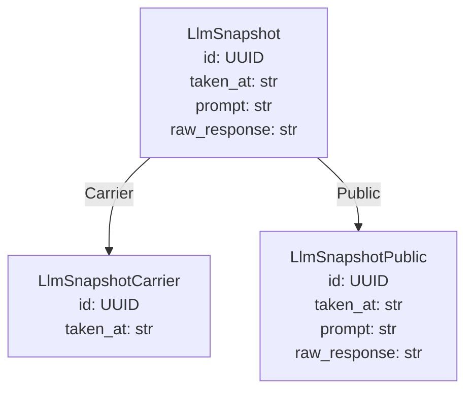
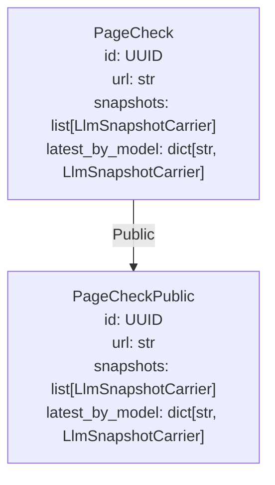
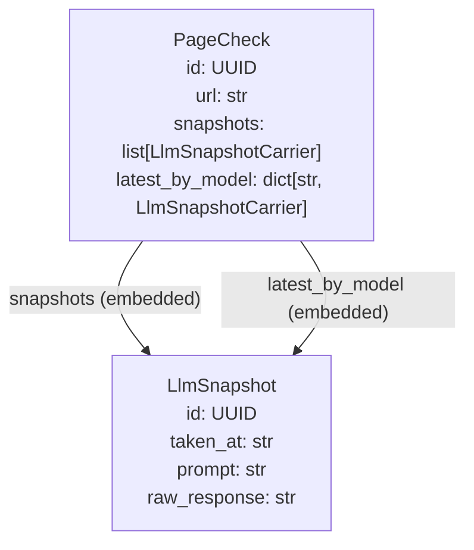

# Generated projection models

<!-- generated by `python bin/gen_example_readmes.py` — do not edit; regenerate with `python bin/gen_example_readmes.py` -->

## Scopes

## LlmSnapshot

### LlmSnapshotCarrier — scope `Carrier`

| field | type | description |
|---|---|---|
| id | UUID |  |
| taken_at | str |  |

### LlmSnapshotPublic — scope `Public`

| field | type | description |
|---|---|---|
| id | UUID |  |
| taken_at | str |  |
| prompt | str |  |
| raw_response | str |  |

## PageCheck

### PageCheckPublic — scope `Public`

| field | type | description |
|---|---|---|
| id | UUID |  |
| url | str |  |
| snapshots | list[LlmSnapshotCarrier] |  |
| latest_by_model | dict[str, LlmSnapshotCarrier] |  |

### PageCheck relationships

