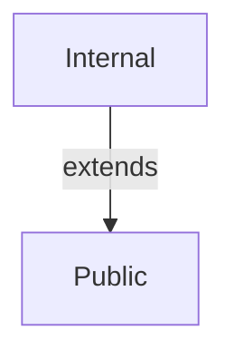
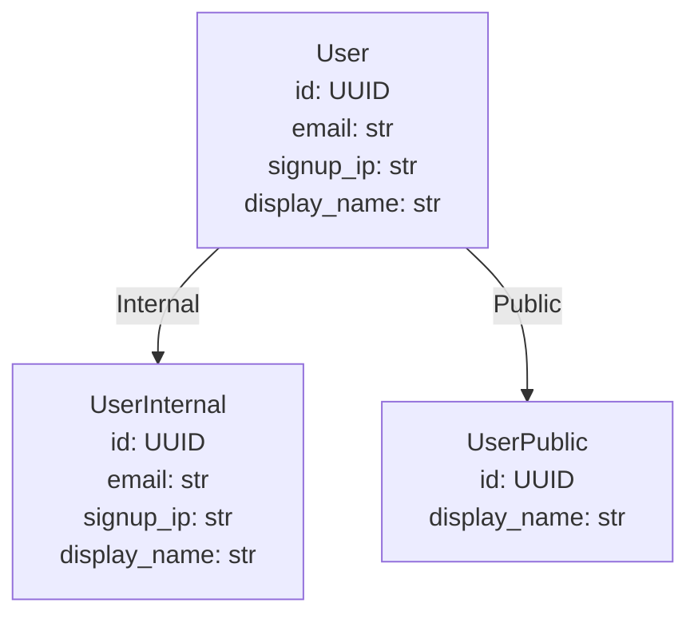

# Generated projection models

<!-- generated by `python bin/gen_example_readmes.py` — do not edit; regenerate with `python bin/gen_example_readmes.py` -->

## Scopes

## User

### UserInternal — scope `Internal`

| field | type | description |
|---|---|---|
| id | UUID |  |
| email | str |  |
| signup_ip | str |  |
| display_name | str |  |

### UserPublic — scope `Public`

| field | type | description |
|---|---|---|
| id | UUID |  |
| display_name | str |  |
