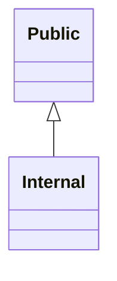
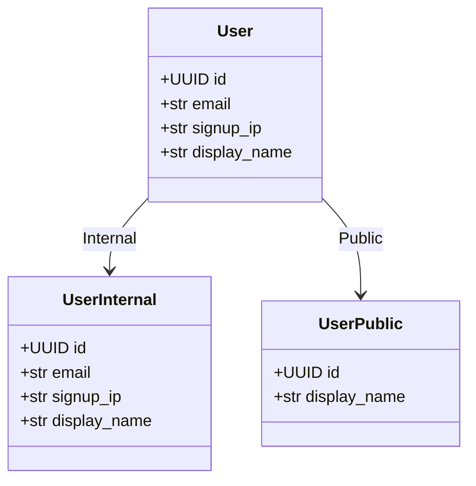

# Generated projection models

<!-- generated by `python bin/gen_example_readmes.py` — do not edit; regenerate with `python bin/gen_example_readmes.py` -->

## Scopes

## User

### UserInternal — scope `Internal`

| field | type | description |
|---|---|---|
| id | UUID | User identifier. |
| email | str | Contact email (internal-only). |
| signup_ip | str | IP at signup (internal-only). |
| display_name | str | Public-facing display name. |

### UserPublic — scope `Public`

| field | type | description |
|---|---|---|
| id | UUID | User identifier. |
| display_name | str | Public-facing display name. |
