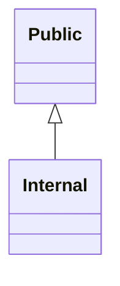
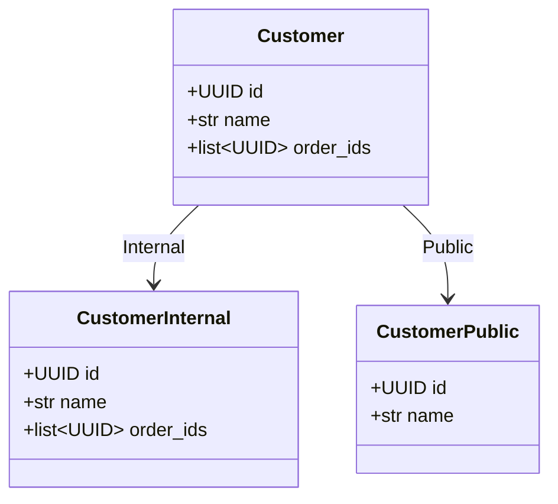
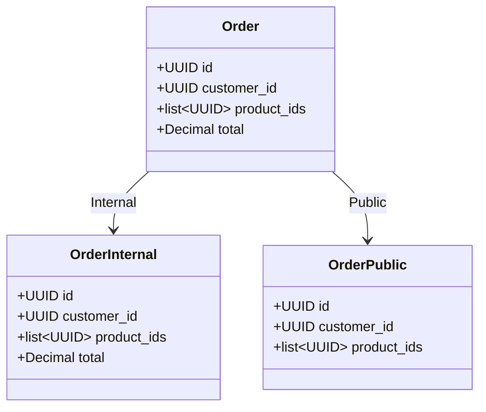
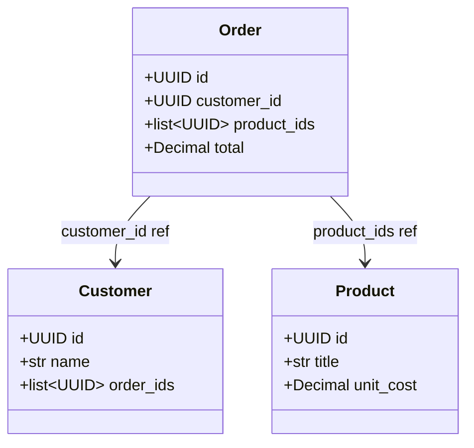

# Generated projection models

<!-- generated by `python bin/gen_example_readmes.py` — do not edit; regenerate with `python bin/gen_example_readmes.py` -->

## Scopes

## Customer

### CustomerInternal — scope `Internal`

| field | type | description |
|---|---|---|
| id | UUID |  |
| name | str |  |
| order_ids | list[UUID] |  |

### CustomerPublic — scope `Public`

| field | type | description |
|---|---|---|
| id | UUID |  |
| name | str |  |

## Order

### OrderInternal — scope `Internal`

| field | type | description |
|---|---|---|
| id | UUID |  |
| customer_id | UUID |  |
| product_ids | list[UUID] |  |
| total | Decimal |  |

### OrderPublic — scope `Public`

| field | type | description |
|---|---|---|
| id | UUID |  |
| customer_id | UUID |  |
| product_ids | list[UUID] |  |

### Order relationships

## Product

### ProductInternal — scope `Internal`

| field | type | description |
|---|---|---|
| id | UUID |  |
| title | str |  |
| unit_cost | Decimal |  |

### ProductPublic — scope `Public`

| field | type | description |
|---|---|---|
| id | UUID |  |
| title | str |  |
