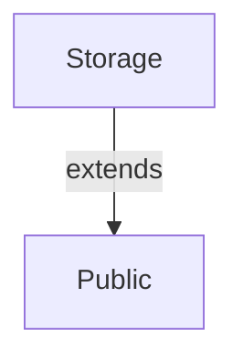
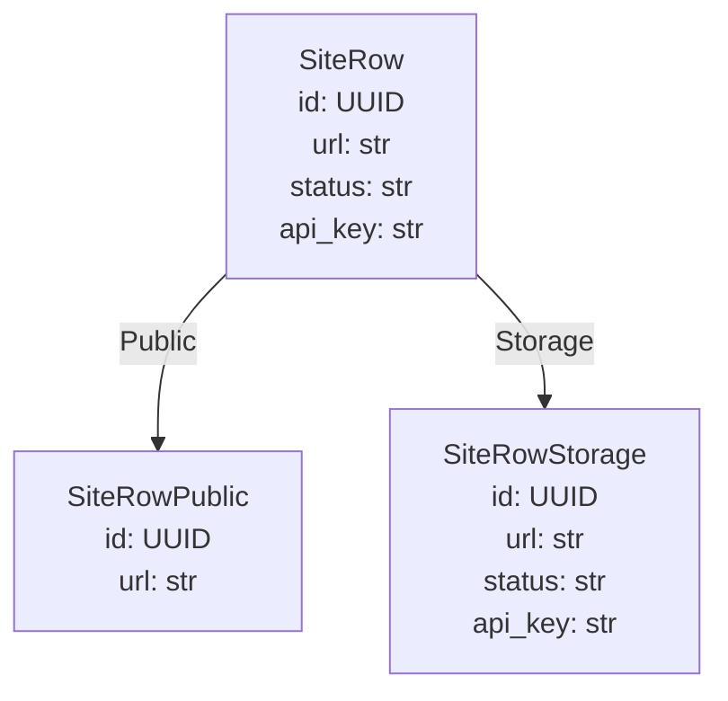

# Generated projection models

<!-- generated by `prism gen` — do not edit; regenerate with `prism gen` -->

## Scopes

## SiteRow

### SiteRowPublic — scope `Public`

| field | type | description |
|---|---|---|
| id | UUID |  |
| url | str |  |

### SiteRowStorage — scope `Storage`

| field | type | description |
|---|---|---|
| id | UUID |  |
| url | str |  |
| status | str |  |
| api_key | str |  |
