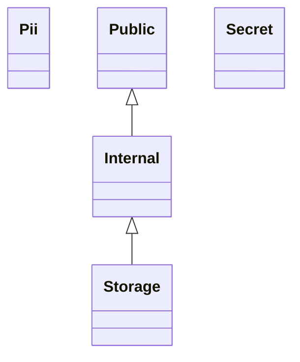
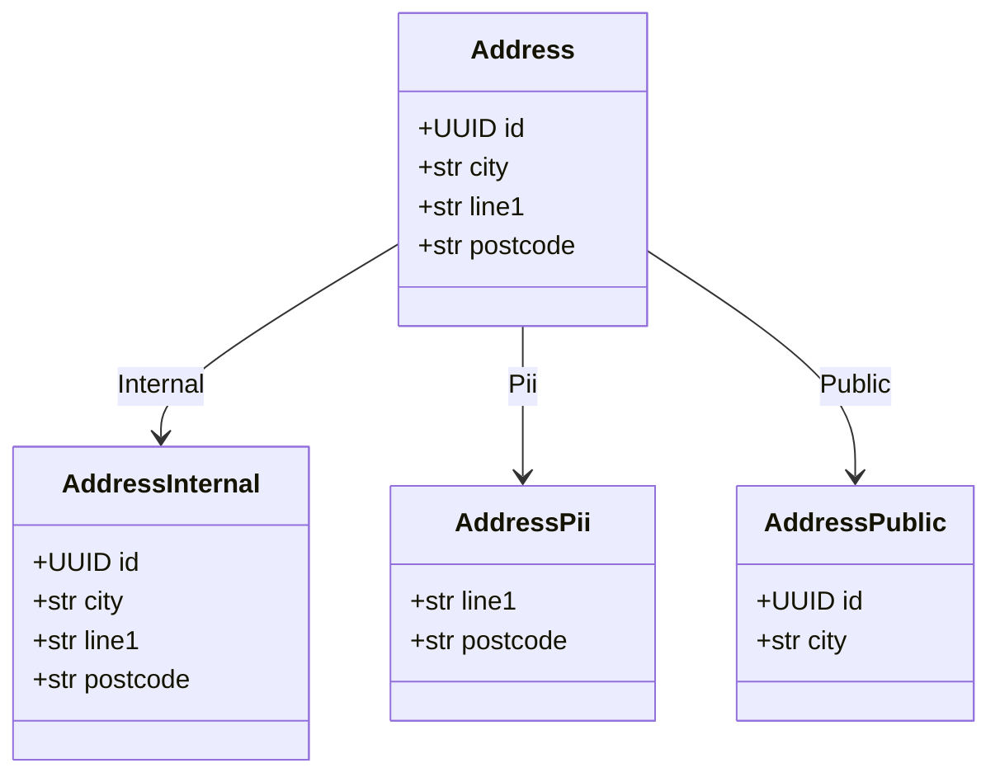
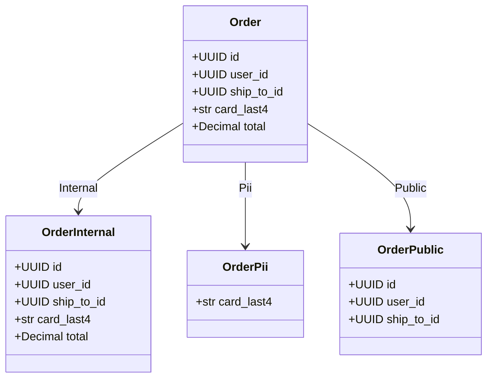
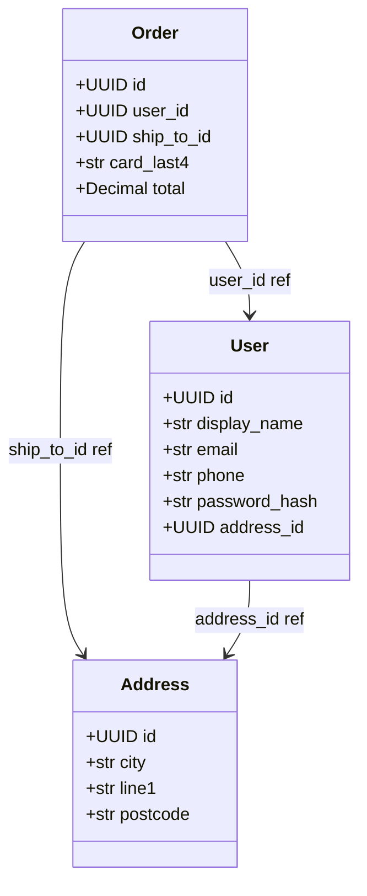
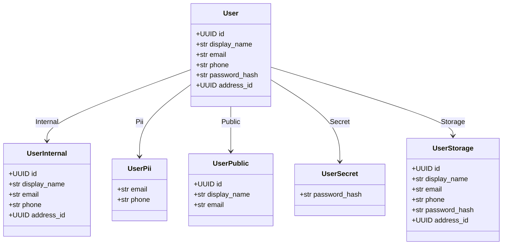
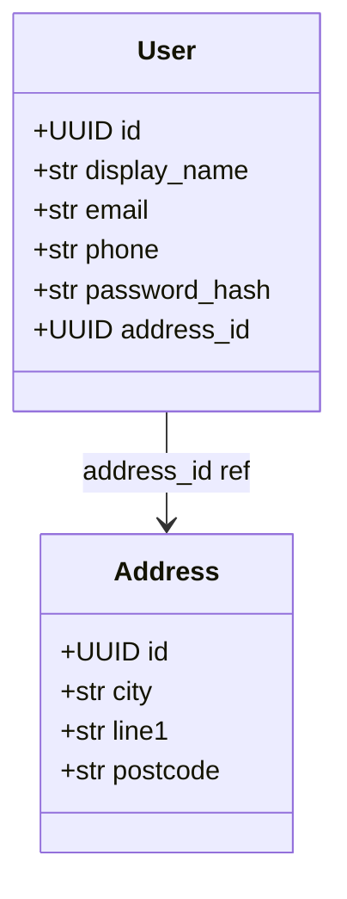

# Generated projection models

<!-- generated by `python bin/gen_example_readmes.py` — do not edit; regenerate with `python bin/gen_example_readmes.py` -->

## Scopes

## Address

### AddressInternal — scope `Internal`

| field | type | description |
|---|---|---|
| id | UUID |  |
| city | str |  |
| line1 | str |  |
| postcode | str |  |

### AddressPii — scope `Pii`

| field | type | description |
|---|---|---|
| line1 | str |  |
| postcode | str |  |

### AddressPublic — scope `Public`

| field | type | description |
|---|---|---|
| id | UUID |  |
| city | str |  |

## Order

### OrderInternal — scope `Internal`

| field | type | description |
|---|---|---|
| id | UUID |  |
| user_id | UUID |  |
| ship_to_id | UUID |  |
| card_last4 | str |  |
| total | Decimal |  |

### OrderPii — scope `Pii`

| field | type | description |
|---|---|---|
| card_last4 | str |  |

### OrderPublic — scope `Public`

| field | type | description |
|---|---|---|
| id | UUID |  |
| user_id | UUID |  |
| ship_to_id | UUID |  |

### Order relationships

## User

### UserInternal — scope `Internal`

| field | type | description |
|---|---|---|
| id | UUID |  |
| display_name | str |  |
| email | str |  |
| phone | str |  |
| address_id | UUID |  |

### UserPii — scope `Pii`

| field | type | description |
|---|---|---|
| email | str |  |
| phone | str |  |

### UserPublic — scope `Public`

| field | type | description |
|---|---|---|
| id | UUID |  |
| display_name | str |  |
| email | str |  |

### UserSecret — scope `Secret`

| field | type | description |
|---|---|---|
| password_hash | str |  |

### UserStorage — scope `Storage`

| field | type | description |
|---|---|---|
| id | UUID |  |
| display_name | str |  |
| email | str |  |
| phone | str |  |
| password_hash | str |  |
| address_id | UUID |  |

### User relationships

