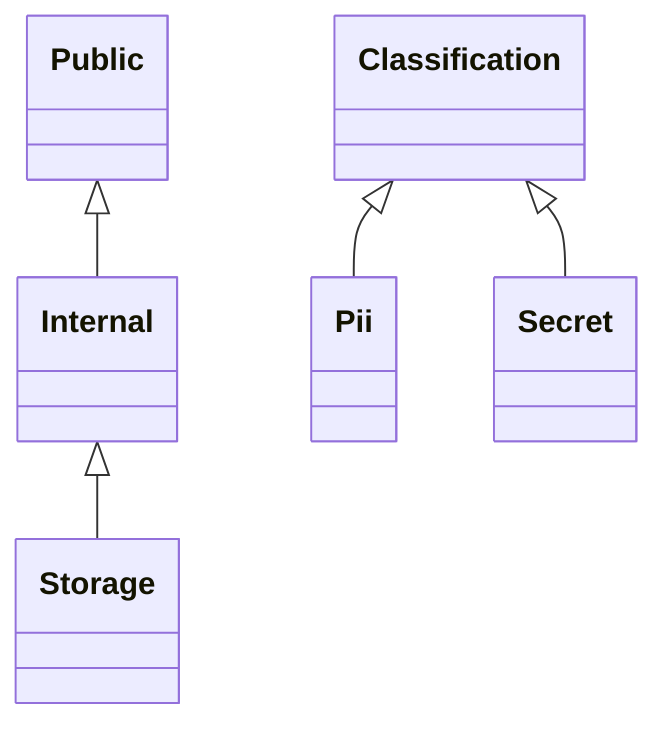
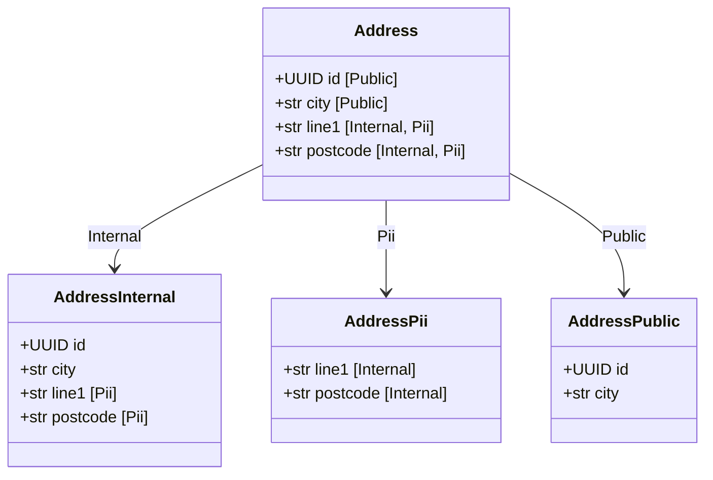
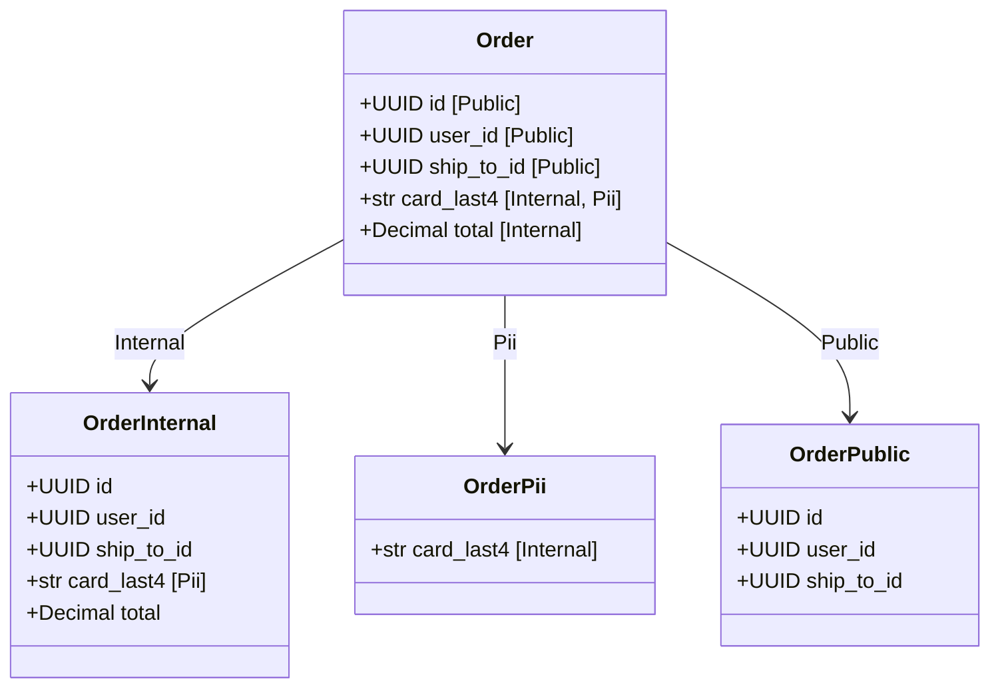
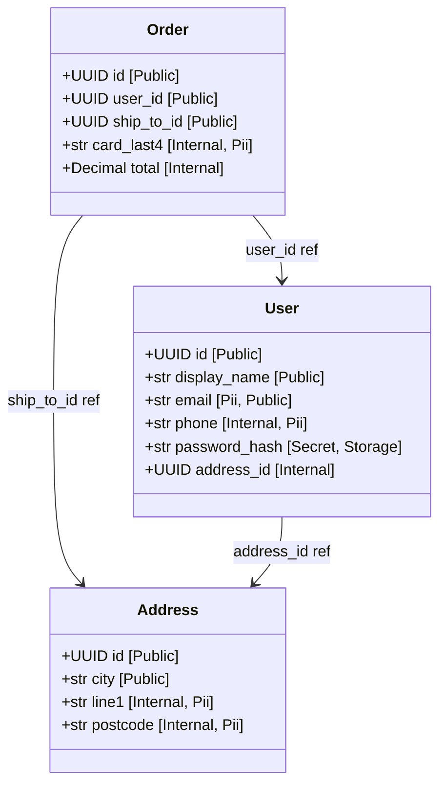
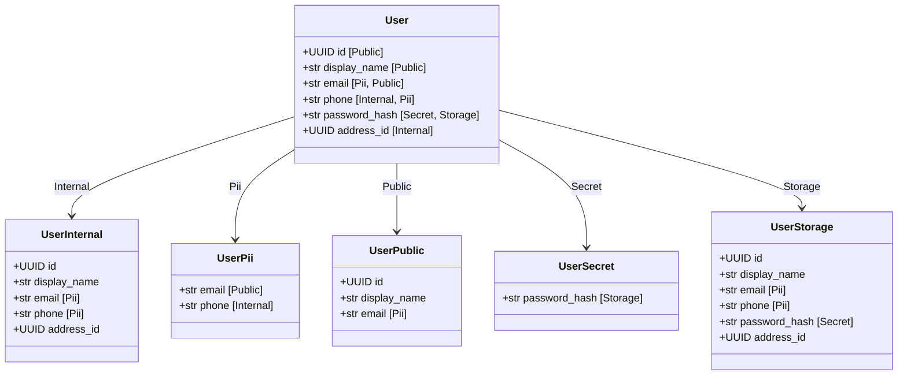
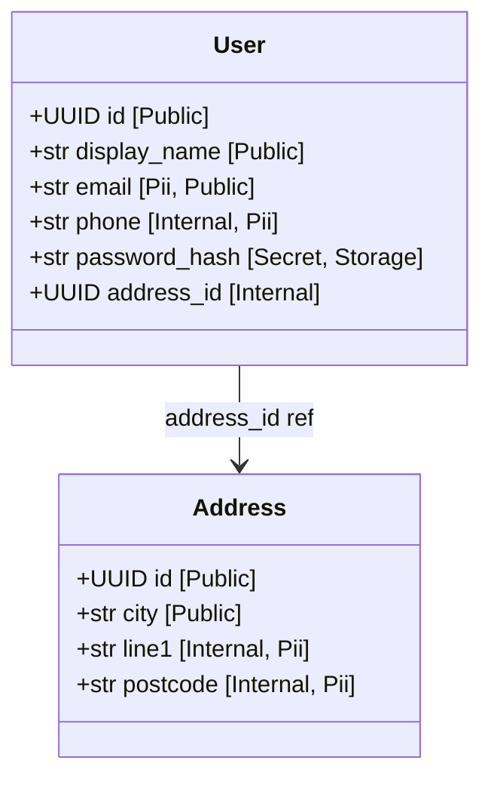

# Generated projection models

<!-- generated by `python bin/gen_example_readmes.py` — do not edit; regenerate with `python bin/gen_example_readmes.py` -->

## Scopes

## Address

### AddressInternal — scope `Internal`

| field | type | description |
|---|---|---|
| id | UUID | Address identifier. |
| city | str | City (non-PII). |
| line1 | str | Street address (PII). |
| postcode | str | Postal code (PII). |

### AddressPii — scope `Pii`

| field | type | description |
|---|---|---|
| line1 | str | Street address (PII). |
| postcode | str | Postal code (PII). |

### AddressPublic — scope `Public`

| field | type | description |
|---|---|---|
| id | UUID | Address identifier. |
| city | str | City (non-PII). |

## Order

### OrderInternal — scope `Internal`

| field | type | description |
|---|---|---|
| id | UUID | Order identifier. |
| user_id | UUID | Who placed the order. |
| ship_to_id | UUID | Shipping address ref. |
| card_last4 | str | Card last 4 digits (PII). |
| total | Decimal | Order total (internal). |

### OrderPii — scope `Pii`

| field | type | description |
|---|---|---|
| card_last4 | str | Card last 4 digits (PII). |

### OrderPublic — scope `Public`

| field | type | description |
|---|---|---|
| id | UUID | Order identifier. |
| user_id | UUID | Who placed the order. |
| ship_to_id | UUID | Shipping address ref. |

### Order relationships

## User

### UserInternal — scope `Internal`

| field | type | description |
|---|---|---|
| id | UUID | User identifier. |
| display_name | str | Public display name. |
| email | str | Contact email — public-facing, still PII. |
| phone | str | Phone number (PII). |
| address_id | UUID | Home address ref. |

### UserPii — scope `Pii`

| field | type | description |
|---|---|---|
| email | str | Contact email — public-facing, still PII. |
| phone | str | Phone number (PII). |

### UserPublic — scope `Public`

| field | type | description |
|---|---|---|
| id | UUID | User identifier. |
| display_name | str | Public display name. |
| email | str | Contact email — public-facing, still PII. |

### UserSecret — scope `Secret`

| field | type | description |
|---|---|---|
| password_hash | str | Password hash (secret, storage-only). |

### UserStorage — scope `Storage`

| field | type | description |
|---|---|---|
| id | UUID | User identifier. |
| display_name | str | Public display name. |
| email | str | Contact email — public-facing, still PII. |
| phone | str | Phone number (PII). |
| password_hash | str | Password hash (secret, storage-only). |
| address_id | UUID | Home address ref. |

### User relationships

