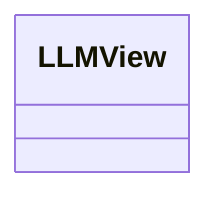
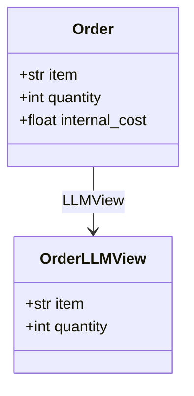

# Generated projection models

<!-- generated by `python bin/gen_example_readmes.py` — do not edit; regenerate with `python bin/gen_example_readmes.py` -->

## Scopes

## Order

### OrderLLMView — scope `LLMView`

| field | type | description |
|---|---|---|
| item | str |  |
| quantity | int |  |
