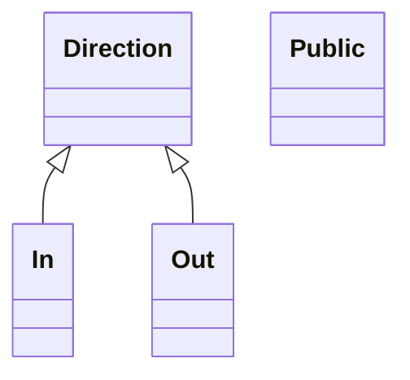
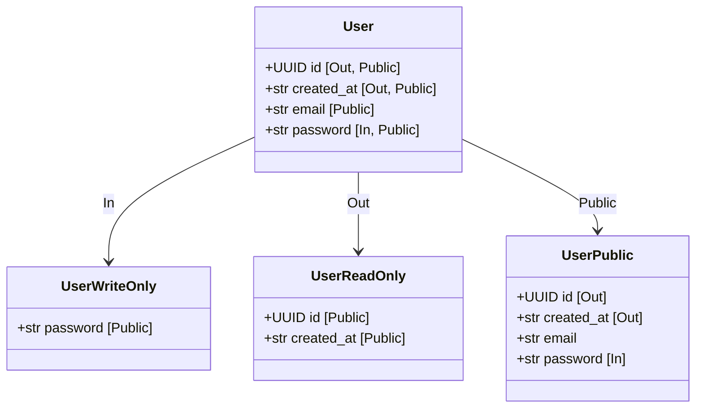

# Generated projection models

<!-- generated by `python bin/gen_example_readmes.py` — do not edit; regenerate with `python bin/gen_example_readmes.py` -->

## Scopes

## User

### UserPublic — scope `Public`

| field | type | description |
|---|---|---|
| id | UUID | Server-set id. |
| created_at | str | Server-set timestamp. |
| email | str | Read-write contact. |
| password | str | Write-only credential. |

### UserReadOnly — scope `ReadOnly`

| field | type | description |
|---|---|---|
| id | UUID | Server-set id. |
| created_at | str | Server-set timestamp. |

### UserWriteOnly — scope `WriteOnly`

| field | type | description |
|---|---|---|
| password | str | Write-only credential. |
