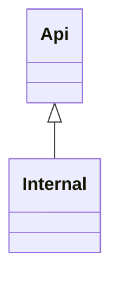
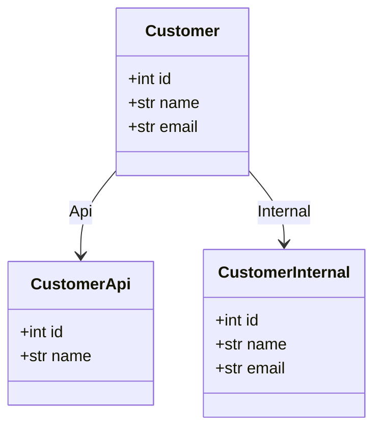
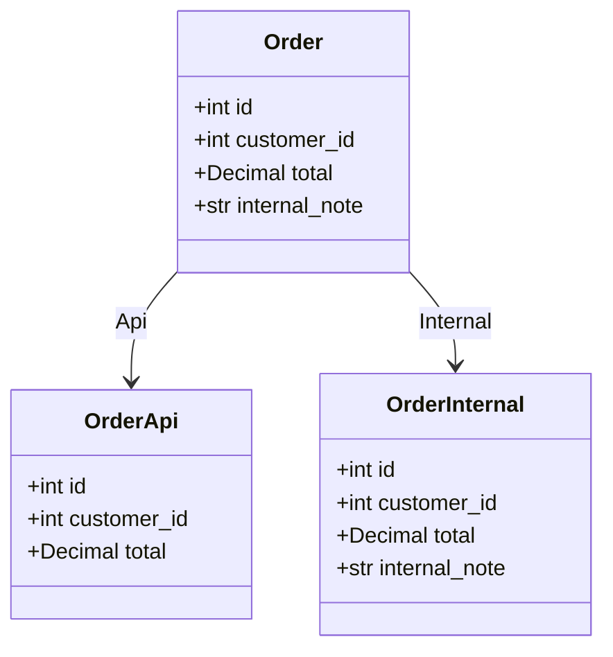
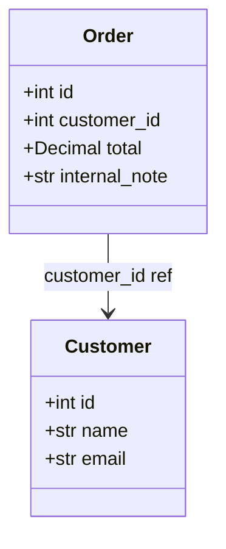

# Generated projection models

<!-- generated by `python bin/gen_example_readmes.py` — do not edit; regenerate with `python bin/gen_example_readmes.py` -->

## Scopes

## Customer

### CustomerApi — scope `Api`

| field | type | description |
|---|---|---|
| id | int |  |
| name | str |  |

### CustomerInternal — scope `Internal`

| field | type | description |
|---|---|---|
| id | int |  |
| name | str |  |
| email | str |  |

## Order

### OrderApi — scope `Api`

| field | type | description |
|---|---|---|
| id | int |  |
| customer_id | int |  |
| total | Decimal |  |

### OrderInternal — scope `Internal`

| field | type | description |
|---|---|---|
| id | int |  |
| customer_id | int |  |
| total | Decimal |  |
| internal_note | str |  |

### Order relationships

